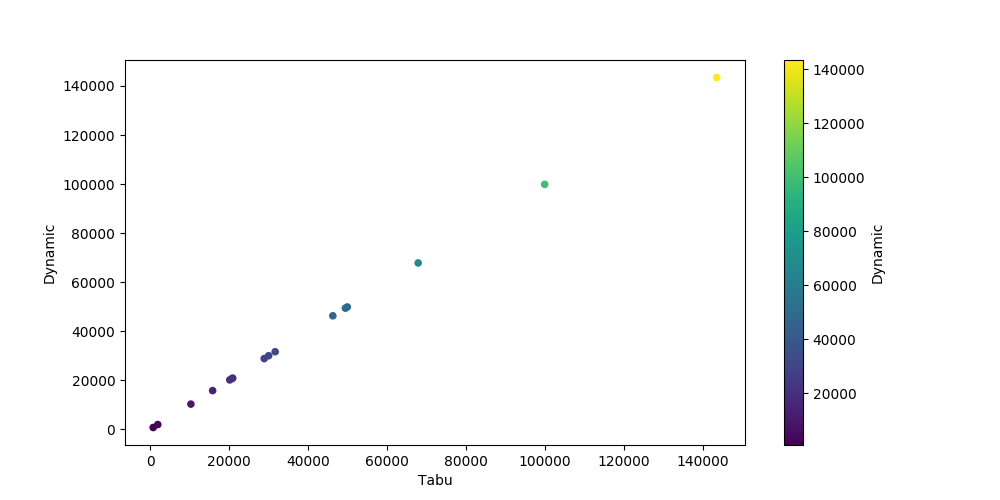

# Applying Three Diferrent Methods for Solve 0-1 Knapsack Problem 

[](https://www.python.org)

## About the Repository

This repository was created for the subject of Computer Theory. The propose of this subject is to improve your skills to solve the __0-1 knapsack__ problem of different ways. The techniques used were __Dynamic Programing__ and two metaheuristics (which are __GRASP__ and __TABU__ search).

## 0-1 Knapsack Problem Description

<p align="center"></p> 
<h6 align="center">Example of 0-1 knapsack problem.</h6>

The image above, show one of example the __0-1 Knapsack Problem__, where which boxes should be chosen to maximize the amount of money while still keeping the overall weight under or equal to 15 kg. For know more about the concepts of this problem, please just click in this [link](https://en.wikipedia.org/wiki/Knapsack_problem).

## Assignments Description:

### Assignment 1: Dynamic Programing

The proposal of this assignment is use dynamic programing to findo the __optimal solution__ of different instance of the __0-1 knapsack__ problem. The code of implementation can be show [clicked here][dynamic_programing.py].

### Assignment 2: GRASP Metaheuristic

The goal of this second assignment is using __GRASP metaheuristic__ for solve the __0-1 Knapsack__ problem. Therefore, as GRASP isn't optimal solution and of metaheuristic, then the results of each instance are close to the __optimal__. But in some instance, the result are the same of the __optimal__ solution.

### Assignment 3: TABU Metaheuristic

Tabu metaheuristic is some of search methods using to optimazing the the __GRASP__ metaheuristc. For more details about the concepts, please readme the paper [Fred W. Glover (1986)](https://www.sciencedirect.com/science/article/abs/pii/0305054886900481). Anyway, the result of this technique for __0-1 Knapsack__ problem was very satisfactory.


## Getting Started

### Prerequisites

```
  For get all of the algorithms you need to understand the "0-1 Knapsack problem" and what's metaheuristic.
```

### Usage

I other to run all of the methods, you need activate the __venv__ (virtual environment) type in your terminal the following code:

```
  source venv/bin/activate
```

The next step is run dynamic_programing, GRASP, and TABU implementations. For run the __dynamic programing__ just type the follow command in your terminal:

```
  python dynamic_programing.py
```
Already to run the __GRASP__ implementation, just type the follow command in your terminal:

```
  python grasp.py
```

And finally the last technique is the __TABU__ search, and for run the script just type the follow command in your termina:

```
  python tabu.py
```

## Some Results

Bellow, follow some graphic results between mataheuristics (__GRASP, TABU__) and __dynamic programming__.

### GRASP vs Dynamic Programing

<p align="center"></p> 
<h6 align="center">Correlation between dynamic programing and GRASP metaheuristic using as score with metric.</h6>

### TABU vs Dynamic Programing


<p align="center"></p> 
<h6 align="center">Correlation between dynamic programing and TABU metaheuristic using as score with metric.</h6>


## AcKnowledgment

  Thanks for the teacher __PhD Eduardo Theodoro Bogue__ for all the tips about the concepts of the methods.
  
  
#

<p align="center"> Sincerely <a href="https://github.com/neemiasbsilva">Neemias B. Silva</a>.</p>


